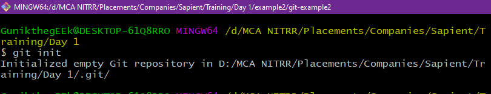
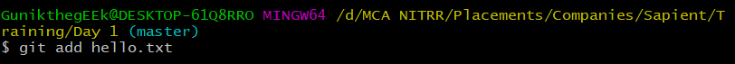

Assignment - 1   PSI-2022 JAN JAVA BATCH -1 | Gunik Maliwal  

<b>
 Make a list of all the git commands covered in the class and explain each of them with an example. Share the screenshots of your work (command execution) in the document along with the respective explanation. 
</b>
---

1. `git init` - creates a new git repository in the present working directory.

    Here I’ve initialized a repo in Day 1 directory.
    

2. `git add` -  makes file changes ready to commit.

    Here I’ve created a file named hello.txt and added it using the git add command.
    

3. `git status` -  displays the current status of changed files and changes to be committed.

    Hello.txt is yet to be committed, status shows new file found name hello.txt

    

4. `git commit ` -   Save changes or make a checkpoint in local repository.

    Hello.txt is committed using the command having commit id - cadc609..

    
    

    `git add . && git commit -m “”` - Combination of git add and commit. If git add is successful then git commit is executed.

5. `git clone ` -    copy a repo to local machine.

    Here I’ve cloned a remote repo using git url.

    

6. `git remote add` - Add a remote repository (a repository which is shared among people for collaboration).

    Here I’ve added a new remote from the repo as new_origin.

    

7. `git show head` -  Points to the latest commit and shows head’s location. .

    Here we can observe that Head points to Main as shown highlighted in green.

    

8. `git branch -a` -  Shows all branches present in current repo.

    Here we have two branches master and new_feature (currently active).

    

9.  `git checkout -b` -  Create your own independent  line of development, eg. to add a new feature etc.

    Here I've created a new branch and named it new_feature.

    

10.  `git merge` -  Combine the changes in current branch with the master/main or default branch. Here I've merged new_feature in to the master and the changes done are reflected below.
    

    

11. `git push` -  send the commited changes to the remote repo.

    
    Push transfer 7 objects blobs to the remote repo, showing commit IDs and branches of both local and remote repos.

    

12. `git push –set-upstream origin master` -   creates an upstream branch, used for keeping local and remote branch in sync for push, pull commands

    
    Upstream branch set up with the remote branch master from origin.

    

13. `git pull` -    fetch content from remote repo and update the local repo as to match the remote, need to resolve conflict if any.

    
    Here git pull adds a new file raw_from_website.txt to local, syncing the changes done in remote with local.

    

13. `git log` -     shows recent changes to a repository, commit id, author,  timings etc.

    
    We can observe the latest commit ID 01c01..Author : Gunik and the commit message along with time stamp.

    