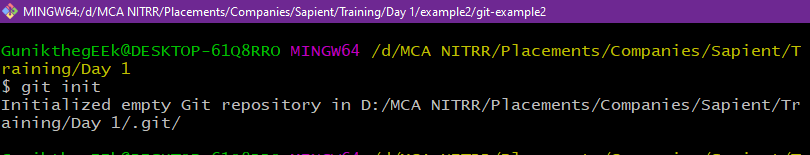

Assignment - 1   PSI-2022 JAN JAVA BATCH -1 | Gunik Maliwal  

<b>
 Make a list of all the git commands covered in the class and explain each of them with an example. Share the screenshots of your work (command execution) in the document along with the respective explanation. 
</b>

---

1. `git init` - creates a new git repository in the present working directory.

    Here I’ve initialized a repo in Day 1 directory.
    

2. `git add` -  makes file changes ready to commit.

    Here I’ve created a file named hello.txt and added it using the git add command.
    

3. `git status` -  displays the current status of changed files and changes to be committed.

    Hello.txt is yet to be committed, status shows new file found name hello.txt

    

4. `git commit ` -   Save changes or make a checkpoint in local repository.
Hello.txt is committed using the command.

    Hello.txt is yet to be committed, status shows new file found name hello.txt

    
